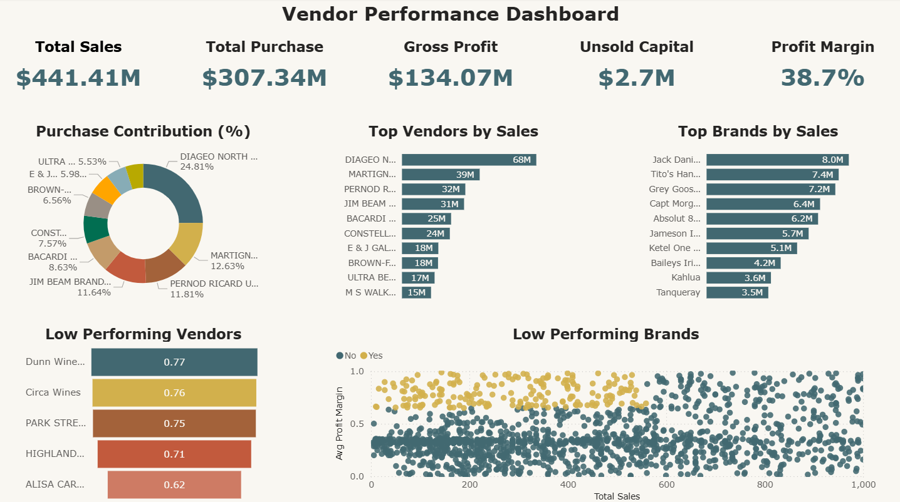

# Vendor Sales Performance Analysis
Understanding Key Drivers of Retail Performance Using Exploratory Analysis and Business Insights

This project examines retail sales, vendor performance, and inventory behavior to uncover the major factors influencing profitability and operational efficiency. The analysis focuses on identifying underperforming brands, evaluating vendor contributions, understanding cost dynamics, and assessing inventory turnover to support data‑driven decision‑making.

## Dataset
- Source: USA Open Data Portal
- Tables (no. of records):
    - sales (12,825,363) 
    - begin_inventory (206,529)
    - end_inventory (224,489)
    - purchases (2,372,474)
    - purchase_prices (12,261)
    - vendor_invoice (5,543)
- Time period: 2024- 2025
- Key features:
  - purchase price
  - sales price
  - freight cost
  - vendors
  - brands and products in inventory

- Created sales summary table by joining multiple tables
- Removed sales with missing prices
- Converted volume from string to numeric
- Created new features such as Gross Profit, Stock Turnover, Profit Margin etc.

## Business Problem
- Identify underperforming brands that require promotional or pricing adjustments.
- Determine top vendors contributing to sales and gross profit.
- Analyze the impact of bulk purchasing on unit costs.
- Assess inventory turnover to reduce holding costs and improve efficiency.
- Investigate using hypothesis testing the profitability variance between high-performing and low-performing brands.

## Key Insights
- Total Purchase Contribution of the top 10 vendors is 65.69% suggesting overdependence on top vendors.
- Bulk buying is ~72% cheaper than small orders for unit cost.
- Total $ 2.71M capital locked in unsold inventory.
- Low-revenue vendors maintain higher profit margins than high-revenue vendors, potentially due to premium pricing or lower operational costs.
- There is a significant difference in the mean profit margins of top-performing and low-performing vendors.

## Power BI Dashboard

## Tools Used
- SQL (PostgreSQL)
- Python (pandas)
- Visualization: matplotlib, seaborn, Power BI
- Environment: Modular Python Codes, Jupyter Notebook

## Contact
- **Author:** Abhishek Tarun 
- **Email:** [abhishek.tarun09@gmail.com](mailto:abhishek.tarun09@gmail.com)